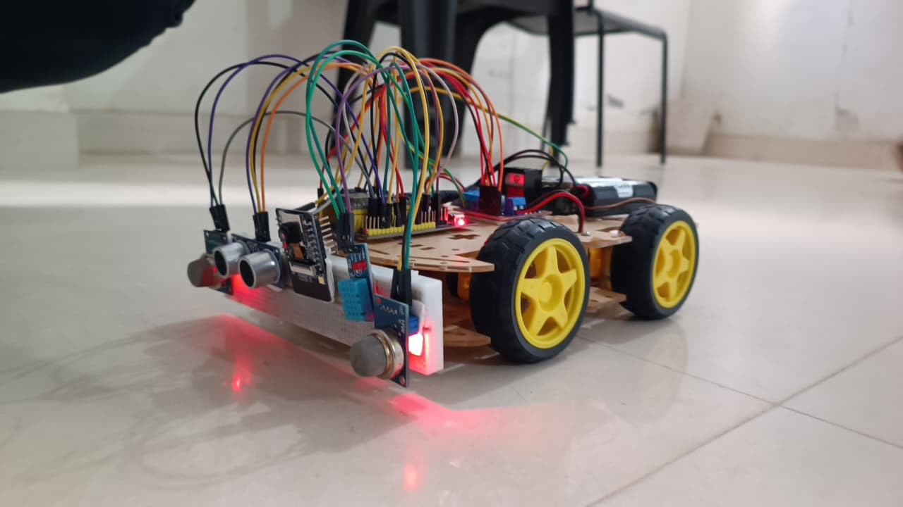
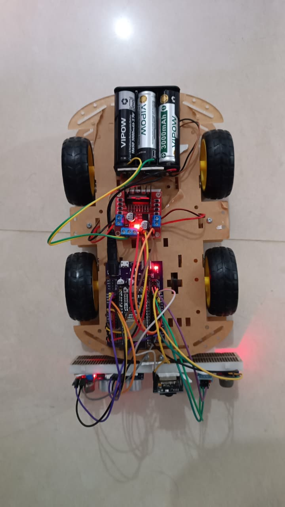

# IoT-Based Tunnel Inspection Rover using ESP32

## Overview

This project implements an **IoT-based tunnel inspection rover** designed to monitor hazardous environments where human inspection is difficult or dangerous.
The rover is controlled through a **Blynk IoT mobile application** and provides **live environmental monitoring and video streaming**.

The system uses **two microcontrollers**:

* **ESP32** – main rover controller (sensors, motors, IoT communication)
* **ESP32-CAM** – live video streaming

The rover continuously monitors **gas concentration, temperature, humidity, and obstacles**, while transmitting the data to the **Blynk cloud platform**.

---

## Features

* Remote rover control through **Blynk mobile app**
* **Live camera streaming** using ESP32-CAM
* **Gas detection** using MQ sensors
* **Temperature and humidity monitoring**
* **Obstacle detection** using ultrasonic sensor
* **Motor speed control**
* Real-time alerts for dangerous gas levels

---

## Hardware Components

* ESP32 Development Board
* ESP32-CAM Module
* L298N Motor Driver
* MQ2 Gas Sensor
* MQ135 Gas Sensor
* DHT11 Temperature and Humidity Sensor
* HC-SR04 Ultrasonic Sensor
* DC Motors
* Robot Chassis
* Battery Pack

---

## Software & Technologies

* Arduino IDE
* ESP32 WiFi Library
* Blynk IoT Platform
* ESP32 Camera Library
* Serial Communication (UART)

---

## System Architecture

The rover system is divided into two main modules:

### 1. Rover Controller (ESP32)

Handles:

* Motor control
* Sensor data acquisition
* Blynk communication
* Obstacle detection
* Gas monitoring

### 2. Camera Controller (ESP32-CAM)

Handles:

* Camera initialization
* Video streaming server
* Sending camera stream link to the main ESP32

---

## Project Folder Structure

```
IoT-Based-Tunnel-Inspection-Rover-using-ESP32
│
├── src
│   ├── main_controller.c
│   └── camera_controller.c
│
├── drivers
│   ├── motor_driver.c
│   ├── gas_sensor.c
│   ├── ultrasonic_sensor.c
│   └── dht_sensor.c
│
└── README.md

---

## Working Principle

1. The **ESP32 connects to WiFi** and communicates with the **Blynk IoT platform**.
2. Sensor data (gas levels, temperature, humidity, and distance) is continuously monitored.
3. If dangerous conditions are detected, alerts are sent to the **Blynk mobile application**.
4. The **ESP32-CAM streams live video** from the rover.
5. The rover can be controlled remotely through **Blynk virtual buttons**.

---

## Blynk Control Functions

| Virtual Pin | Function            |
| ----------- | ------------------- |
| V4          | Move Forward        |
| V5          | Move Backward       |
| V6          | Turn Right          |
| V7          | Turn Left           |
| V8          | Stop Motors         |
| V9          | Motor Speed Control |
| V11         | Distance Monitoring |
| V12         | Camera Stream Link  |

---
## Prototype Images





---

## Applications

* Tunnel inspection
* Industrial safety monitoring
* Hazardous gas detection
* Disaster rescue environments
* Underground mining safety

---

## Future Improvements

* Autonomous navigation
* AI-based obstacle detection
* Cloud data logging
* GPS tracking system
* Multiple camera integration

---

## Author

GUNAPRASANTH PASUPULETI

Embedded Systems / IoT Project
